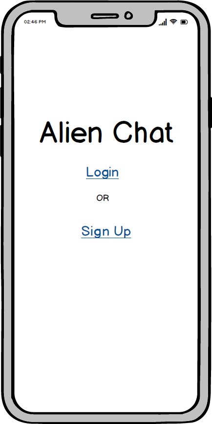
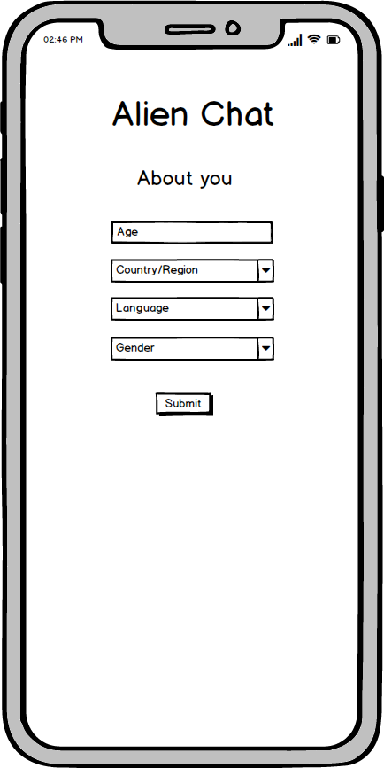
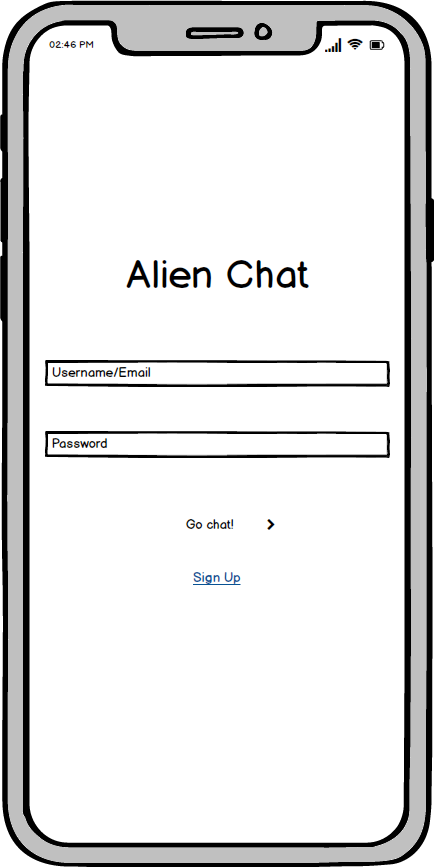
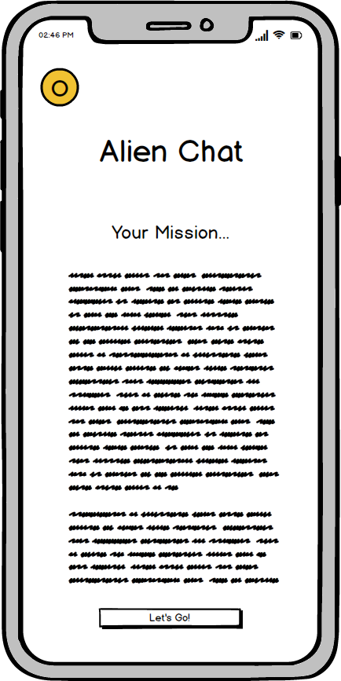
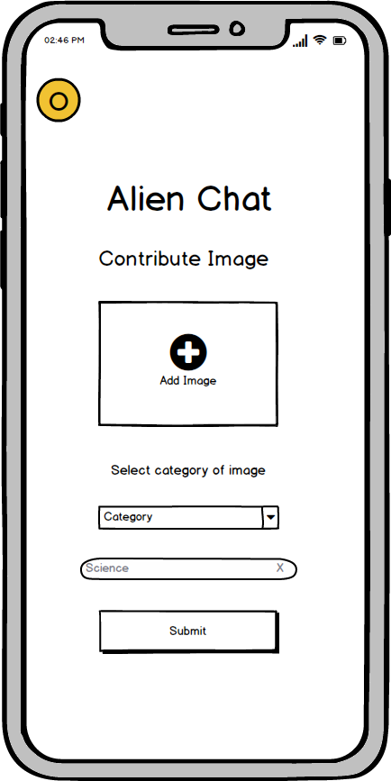

# Alien Chat
This is a simple game that uses photo comparisons to discover what the human race would like to share with an alien population. 

Ever since the ability of mankind to launch objects into space, the search for intelligent life and question of how to reach it if it exists has been prevalent.Since the 70s, several prominent efforts have been made to come up with a collection of information that is not only accessible to alien intelligence, but is also information that could be valuable to know where Earth is and some information about it.

One of the most prevalent issues that is always encountered when a group of people attempt to collect data to be representative of a large group is the sample size of the group of people that were able to contribute to the ideas being included in the data collection.

By allowing anyone to both upload images that they consider representative of a topic, and allowing anyone to compare what images for a given section are the most representative of that idea we aim to reduce the inherent bias of both the ideas that are representative of this planet, but also what types of information convey the ideas we are trying to send.

Accurate and accessible representation of the planet according to the people on the planet is integral to the generation of enough interest in the project to be able to fund and support a program that can contact alien life. By allowing the content pool, and the comparison of the content to be contributed to and evaluated by anyone and everyone, we aim to build a representation of the world that avoids the inherent bias of any one group of people.

Our team utilized Balsamiq in order to create wireframes to envision the flow of the mobile app. We built out the front end of our app in React, and would use a relational database to store user information, content uploaded by users, and the choices our users are making as they compare the images.

## Built With
Balsamiq
React

## Versioning
v1.0.0

## Authors
Ashton Bailey @ashtonkbailey  
Dina Caraballo @djcaraballo  
Lucas Alderfer @LucasAlderfer  
Melvin Cedeno @thecraftedgem  
Ryan McNeil @ryan-mcneil  

## Acknowledgments
Conceived during NASA's International Space Apps Challenge of 2018, this app has been developed specifically for the Remix the Golden Record challenge.

## Wireframes

